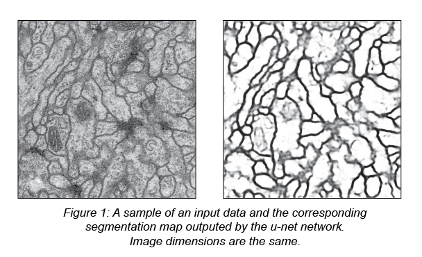

# U-net

This is an implementation of the U-net paper: [U-Net: Convolutional Networks for Biomedical Image Segmentation](https://arxiv.org/abs/1505.04597)

## Requirements

To run the project properly you'll need:

* tensorflow 2.1
* scikit-image
* numpy

Install requirements

```bash
$ pip install -r requirements.txt
```

## Data

Ensure you have the EM dataset files such as 

```
data/train-volume.tif
data/train-labels.tif
data/test-volume.tif
```

## Usage

You'll find which parameters you can change 

```bash
$ python main.py -h
usage: main.py [-h] [--mode {train,predict_test,predict}] [--weights WEIGHTS]
               [--pooling POOLING] [--conv CONV] [--img_size IMG_SIZE]
               [--batch_size BATCH_SIZE] [--step_per_epoch STEP_PER_EPOCH]
               [--epoch EPOCH] [--input INPUT] [--model_file MODEL_FILE]
               [--padding {same,valid}]
               [--block_type {standard,residual,rrdb}] [--dataset {EM}]
               [--batch_norm [BATCH_NORM]]

optional arguments:
  -h, --help            show this help message and exit
  --mode {train,predict_test,predict}
                        Either 'train' or 'predict'
  --weights WEIGHTS     filepath to pretrained weights
  --pooling POOLING     Number of pooling operation
  --conv CONV           Number of convolutional layer
  --img_size IMG_SIZE   Input image size
  --batch_size BATCH_SIZE
                        Batch size
  --step_per_epoch STEP_PER_EPOCH
                        Step per epoch
  --epoch EPOCH         Number of epoch
  --input INPUT         Default image or image folder to predict
  --model_file MODEL_FILE
                        Model to load for prediction
  --padding {same,valid}
                        Default padding
  --block_type {standard,residual,rrdb}
                        Block type
  --dataset {EM}        Dataset name supported
  --batch_norm [BATCH_NORM]
                        Add batch normalisation layers.
```

## Training

One can train an u-net model with the EM dataset provided with the reposetory.

In order to train the model with default parameters:

```bash
$ python main.py --mode train 
```

or training with __specified parameters__:

```bash
## Architecture based parameters 
$ python main.py --mode train --pooling 4             ## Number of pooling operation
$ python main.py --mode train --conv 2                ## Number of convolution in a block
$ python main.py --mode train --batch_norm yes        ## Adding batch normalization layers
$ python main.py --mode train --padding same          ## Changing padding type
$ python main.py --mode train --block_type residual   ## Changing block type

# Global parameters
$ python main.py --mode train --img_size 256          ## Changing input image size
$ python main.py --mode train --batch_size 32         ## Changing batch size
$ python main.py --mode train --step_per_epoch 300    ## Changing step per epoch
$ python main.py --mode train --epoch 10              ## Changing number of epoch
```

You can also load ___weights___ from a ___pretrained network___ as initialisation 	

``````bash
$ python main.py --mode train --weights data/models/unet_weight.01-0.2491.hdf5
``````

You may change all parameters ___at once___:

``` bash
$ python main.py --mode train --img_size 256 --pooling 2 --conv 3 --padding valid --block_type residual --batch_norm yes --epoch 10 --step_per_epoch 300
```

The models are saved during training in ___`data/models/`___

#### Block type supported

You can change the block type as you like. Here is the list of implemented blocks:

* Standard: Convolutions
* Residual: Convolutions + Residual connection 
* RRDB: (Convolutions + Residual connection) x Residual connections 
  * Proposed in the ESRGAN paper

## Inference

### Selecting model

if `--model_file` is not specified, a list of existing models will be prompted to the user. 

### Predicting EM test data

```bash
$ python main.py --mode predict_test
```

The predicted images will be saved along the input data in ___`data/tmp/test `___

 

### Predicting image files 

This project allows inference for image files, just specify a file or a folder of fils with the input parameter such as:

``````` Bash
$ python main.py --mode predict --input data/predict_input.png
```````

Predictions will be saved in ___`data/tmp/predictions/`___


## Improvements & todo

#### Code

* Load hyperparameters from config file
* Subparser regarding mode 
* Link config and saved models 
* Gather predict / predict_test
* pytest 
* fix imports
* Better code design
* Better parametrisation 

#### Other

* Add data augmentation functions such as elastic deformations as described in the original paper
* Add other datasets + Allowing multi class, _this project only supports binary mask as the EM dataset provides_
* Compute metrics as described in the paper: Warping Error, Intersection Over Union etc...
* Exporting best model somewhere else  
* Weighted loss as described in the original paper
* Standardize datasets

